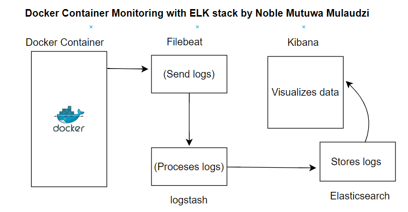

# ELK Stack with Docker Monitoring and Log Forwarding By Noble Mulaudzi

This repository contains Ansible code to set up a robust ELK (Elasticsearch, Logstash, Kibana) stack, coupled with Docker monitoring 


## Architecture Overview

The architecture consists of the following components:

1. **Docker Containers:** Running applications and generating logs.
2. **Filebeat:** Collecting logs from Docker containers and cAdvisor.
3. **Logstash:** Processing and transforming logs from Filebeat.
4. **Elasticsearch:** Storing and indexing the processed log data.
5. **Kibana:** Providing a visual interface for log data exploration and analysis.

## Instructions

1. Ensure you have Ansible installed on your local machine.
2. Clone this repository to your local system.

### ELK Stack Installation

1. Update the `inventory.ini` file with your server's IP address, SSH username, and private key file path.
2. Modify the `filebeat`  file


### Run the Playbook

Execute the following command in your terminal to deploy the ELK stack and monitoring agents:

```bash
ansible-playbook playbook.yml


### Tutorial by Noble Mutuwa Isaya